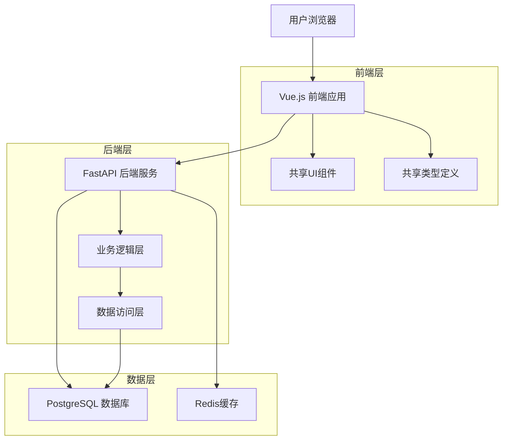
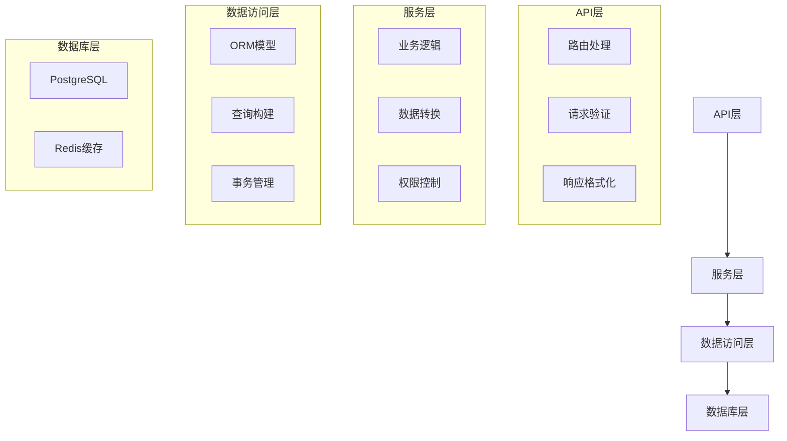
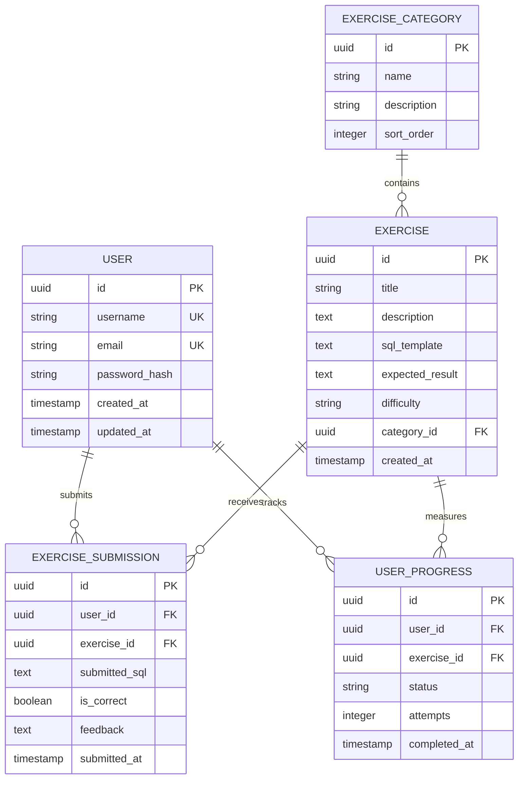

# 系统架构设计文档

## 1. 架构概览

### 1.1 整体架构



### 1.2 Monorepo架构优势

- **代码共享**: 通过packages目录实现类型定义、工具函数、UI组件的跨应用复用
- **统一依赖管理**: 根目录package.json统一管理依赖版本，避免版本冲突
- **原子化提交**: 相关功能的前后端代码可以在同一个提交中修改
- **统一构建流程**: 集中化的CI/CD配置和构建脚本
- **更好的重构支持**: 跨应用的重构可以在单个仓库中完成

## 2. 目录结构设计

### 2.1 整体目录结构

```
sql-learn/                      # 项目根目录
├── apps/                       # 应用目录
│   ├── frontend/              # 前端应用
│   │   ├── src/
│   │   │   ├── api/           # API客户端
│   │   │   ├── components/    # 页面特定组件
│   │   │   ├── pages/         # 页面组件
│   │   │   ├── stores/        # 状态管理
│   │   │   ├── router/        # 路由配置
│   │   │   ├── assets/        # 静态资源
│   │   │   └── config/        # 前端配置
│   │   ├── public/            # 公共静态资源
│   │   ├── tests/             # 前端测试
│   │   ├── package.json       # 前端依赖
│   │   └── vite.config.ts     # 构建配置
│   └── backend/               # 后端应用
│       ├── app/
│       │   ├── api/           # API路由
│       │   ├── core/          # 核心配置
│       │   ├── models/        # 数据模型
│       │   ├── schemas/       # Pydantic模式
│       │   ├── services/      # 业务逻辑
│       │   └── utils/         # 后端工具函数
│       ├── tests/             # 后端测试
│       ├── migrations/        # 数据库迁移
│       ├── requirements.txt   # Python依赖
│       └── main.py            # 应用入口
├── packages/                   # 共享包目录
│   ├── shared-types/          # 共享类型定义
│   ├── shared-utils/          # 共享工具函数
│   └── ui-components/         # 共享UI组件
├── scripts/                    # 项目脚本
├── docs/                       # 项目文档
├── tests/                      # 集成测试
├── docker/                     # Docker配置
├── .github/                    # GitHub工作流
└── logs/                       # 日志文件
```

### 2.2 共享包设计

#### 2.2.1 shared-types 共享类型定义

```typescript
// packages/shared-types/src/api/auth.ts
export interface LoginRequest {
  username: string;
  password: string;
}

export interface LoginResponse {
  access_token: string;
  token_type: string;
  expires_in: number;
}

export interface User {
  id: string;
  username: string;
  email: string;
  created_at: string;
}
```

#### 2.2.2 shared-utils 共享工具函数

```typescript
// packages/shared-utils/src/constants/api.ts
export const API_VERSION = 'v1';
export const API_BASE_URL = `/api/${API_VERSION}`;

export const ENDPOINTS = {
  AUTH: {
    LOGIN: `${API_BASE_URL}/auth/login`,
    REGISTER: `${API_BASE_URL}/auth/register`,
    ME: `${API_BASE_URL}/auth/me`,
  },
  EXERCISES: {
    LIST: `${API_BASE_URL}/exercises`,
    DETAIL: (id: string) => `${API_BASE_URL}/exercises/${id}`,
    SUBMIT: (id: string) => `${API_BASE_URL}/exercises/${id}/submit`,
  },
} as const;
```

#### 2.2.3 ui-components 共享UI组件

```vue
<!-- packages/ui-components/src/components/Button/Button.vue -->
<template>
  <button 
    :class="buttonClasses" 
    :disabled="disabled"
    @click="$emit('click', $event)"
  >
    <slot />
  </button>
</template>

<script setup lang="ts">
interface Props {
  variant?: 'primary' | 'secondary' | 'danger';
  size?: 'small' | 'medium' | 'large';
  disabled?: boolean;
}

const props = withDefaults(defineProps<Props>(), {
  variant: 'primary',
  size: 'medium',
  disabled: false,
});

const buttonClasses = computed(() => [
  'btn',
  `btn--${props.variant}`,
  `btn--${props.size}`,
  { 'btn--disabled': props.disabled }
]);
</script>
```

## 3. 前端架构设计

### 3.1 技术栈

- **框架**: Vue 3 + Composition API
- **类型系统**: TypeScript
- **构建工具**: Vite
- **状态管理**: Pinia
- **路由**: Vue Router 4
- **HTTP客户端**: Axios
- **样式**: CSS3 + PostCSS

### 3.2 目录结构

```
apps/frontend/src/
├── api/                    # API客户端
│   ├── client.ts          # HTTP客户端配置
│   ├── auth.ts            # 认证API
│   ├── exercises.ts       # 练习API
│   └── user.ts            # 用户API
├── components/            # 页面特定组件
│   ├── ExerciseCard/
│   ├── UserProfile/
│   └── SqlEditor/
├── pages/                 # 页面组件
│   ├── Home/
│   ├── Login/
│   ├── Exercises/
│   └── Profile/
├── stores/                # Pinia状态管理
│   ├── auth.ts
│   ├── exercises.ts
│   └── user.ts
├── router/                # 路由配置
│   ├── index.ts
│   └── guards.ts
├── assets/                # 静态资源
│   ├── images/
│   └── styles/
├── config/                # 前端配置
│   ├── index.ts
│   └── env.ts
└── main.ts               # 应用入口
```

### 3.3 状态管理设计

```typescript
// apps/frontend/src/stores/auth.ts
import { defineStore } from 'pinia';
import type { User, LoginRequest } from '@sql-learn/shared-types';

export const useAuthStore = defineStore('auth', () => {
  const user = ref<User | null>(null);
  const token = ref<string | null>(null);
  const isAuthenticated = computed(() => !!token.value);

  const login = async (credentials: LoginRequest) => {
    const response = await authApi.login(credentials);
    token.value = response.access_token;
    user.value = await authApi.getMe();
  };

  const logout = () => {
    user.value = null;
    token.value = null;
  };

  return {
    user: readonly(user),
    token: readonly(token),
    isAuthenticated,
    login,
    logout,
  };
});
```

## 4. 后端架构设计

### 4.1 技术栈

- **框架**: FastAPI
- **语言**: Python 3.11
- **数据库**: PostgreSQL
- **ORM**: SQLAlchemy
- **迁移工具**: Alembic
- **认证**: JWT
- **验证**: Pydantic

### 4.2 目录结构

```
apps/backend/
├── app/
│   ├── api/               # API路由
│   │   ├── v1/
│   │   │   ├── auth.py
│   │   │   ├── exercises.py
│   │   │   └── users.py
│   │   └── __init__.py
│   ├── core/              # 核心配置
│   │   ├── config.py
│   │   ├── security.py
│   │   └── database.py
│   ├── models/            # 数据模型
│   │   ├── user.py
│   │   ├── exercise.py
│   │   └── __init__.py
│   ├── schemas/           # Pydantic模式
│   │   ├── auth.py
│   │   ├── exercise.py
│   │   └── user.py
│   ├── services/          # 业务逻辑
│   │   ├── auth_service.py
│   │   ├── exercise_service.py
│   │   └── user_service.py
│   └── utils/             # 后端工具函数
│       ├── validators.py
│       └── helpers.py
├── tests/                 # 后端测试
├── migrations/            # 数据库迁移
├── requirements.txt       # Python依赖
└── main.py               # 应用入口
```

### 4.3 分层架构设计



## 5. 数据库设计

### 5.1 核心实体关系



### 5.2 数据库配置

```python
# apps/backend/app/core/database.py
from sqlalchemy import create_engine
from sqlalchemy.ext.declarative import declarative_base
from sqlalchemy.orm import sessionmaker
from .config import settings

engine = create_engine(
    settings.DATABASE_URL,
    pool_pre_ping=True,
    pool_recycle=300,
    pool_size=10,
    max_overflow=20
)

SessionLocal = sessionmaker(autocommit=False, autoflush=False, bind=engine)
Base = declarative_base()

def get_db():
    db = SessionLocal()
    try:
        yield db
    finally:
        db.close()
```

## 6. API设计规范

### 6.1 RESTful API设计

```python
# apps/backend/app/api/v1/exercises.py
from fastapi import APIRouter, Depends, HTTPException
from sqlalchemy.orm import Session
from ...core.database import get_db
from ...services.exercise_service import ExerciseService
from ...schemas.exercise import ExerciseCreate, ExerciseResponse

router = APIRouter()

@router.get("/", response_model=List[ExerciseResponse])
async def list_exercises(
    skip: int = 0,
    limit: int = 100,
    category_id: Optional[str] = None,
    difficulty: Optional[str] = None,
    db: Session = Depends(get_db)
):
    """获取练习列表"""
    service = ExerciseService(db)
    return service.get_exercises(
        skip=skip, 
        limit=limit, 
        category_id=category_id,
        difficulty=difficulty
    )

@router.get("/{exercise_id}", response_model=ExerciseResponse)
async def get_exercise(
    exercise_id: str,
    db: Session = Depends(get_db)
):
    """获取单个练习详情"""
    service = ExerciseService(db)
    exercise = service.get_exercise(exercise_id)
    if not exercise:
        raise HTTPException(status_code=404, detail="Exercise not found")
    return exercise
```

### 6.2 API版本管理

```python
# apps/backend/app/api/__init__.py
from fastapi import APIRouter
from .v1 import auth, exercises, users

api_router = APIRouter()

# V1 API路由
api_v1_router = APIRouter(prefix="/v1")
api_v1_router.include_router(auth.router, prefix="/auth", tags=["authentication"])
api_v1_router.include_router(exercises.router, prefix="/exercises", tags=["exercises"])
api_v1_router.include_router(users.router, prefix="/users", tags=["users"])

api_router.include_router(api_v1_router, prefix="/api")
```

## 7. 安全架构设计

### 7.1 认证与授权

```python
# apps/backend/app/core/security.py
from datetime import datetime, timedelta
from jose import JWTError, jwt
from passlib.context import CryptContext
from .config import settings

pwd_context = CryptContext(schemes=["bcrypt"], deprecated="auto")

def create_access_token(data: dict, expires_delta: Optional[timedelta] = None):
    to_encode = data.copy()
    if expires_delta:
        expire = datetime.utcnow() + expires_delta
    else:
        expire = datetime.utcnow() + timedelta(minutes=15)
    to_encode.update({"exp": expire})
    encoded_jwt = jwt.encode(to_encode, settings.SECRET_KEY, algorithm=settings.ALGORITHM)
    return encoded_jwt

def verify_token(token: str):
    try:
        payload = jwt.decode(token, settings.SECRET_KEY, algorithms=[settings.ALGORITHM])
        username: str = payload.get("sub")
        if username is None:
            return None
        return username
    except JWTError:
        return None
```

### 7.2 数据验证

```python
# apps/backend/app/schemas/auth.py
from pydantic import BaseModel, EmailStr, validator
from typing import Optional

class UserCreate(BaseModel):
    username: str
    email: EmailStr
    password: str
    
    @validator('username')
    def username_alphanumeric(cls, v):
        assert v.isalnum(), 'Username must be alphanumeric'
        assert len(v) >= 3, 'Username must be at least 3 characters'
        return v
    
    @validator('password')
    def password_strength(cls, v):
        assert len(v) >= 8, 'Password must be at least 8 characters'
        return v

class UserResponse(BaseModel):
    id: str
    username: str
    email: str
    created_at: datetime
    
    class Config:
        orm_mode = True
```

## 8. 性能优化设计

### 8.1 前端性能优化

- **代码分割**: 使用Vue Router的懒加载
- **资源优化**: 图片压缩、CSS/JS压缩
- **缓存策略**: HTTP缓存、浏览器缓存
- **CDN加速**: 静态资源CDN分发

### 8.2 后端性能优化

- **数据库优化**: 索引优化、查询优化
- **缓存策略**: Redis缓存热点数据
- **连接池**: 数据库连接池管理
- **异步处理**: FastAPI异步特性

### 8.3 监控指标

- **响应时间**: API响应时间 < 200ms
- **吞吐量**: 支持1000+ 并发用户
- **错误率**: 错误率 < 1%
- **可用性**: 系统可用性 > 99.9%

## 9. 扩展性设计

### 9.1 水平扩展

- **负载均衡**: Nginx负载均衡
- **数据库分片**: 按用户ID分片
- **缓存集群**: Redis集群
- **微服务**: 按业务域拆分服务

### 9.2 垂直扩展

- **服务器升级**: CPU、内存、存储升级
- **数据库优化**: 读写分离、主从复制
- **CDN优化**: 全球CDN节点部署

这个架构设计确保了系统的可维护性、可扩展性和高性能，为SQL学习平台的长期发展奠定了坚实的技术基础。